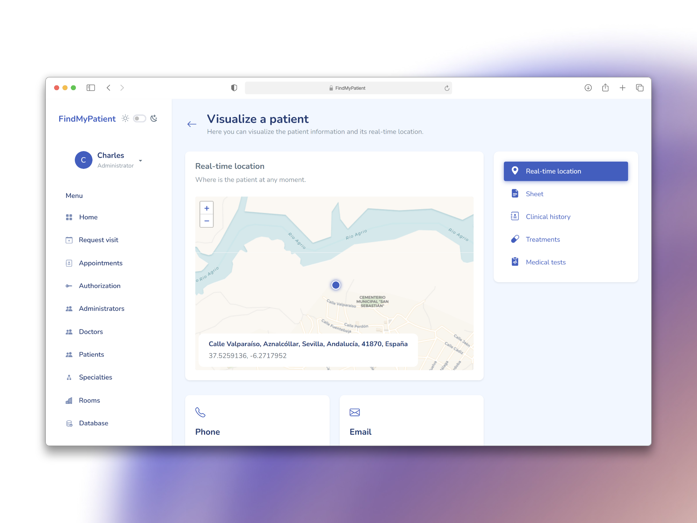

# FindMyPatient

## Table of Contents

- [FindMyPatient](#findmypatient)
  - [Table of Contents](#table-of-contents)
  - [Overview](#overview)
  - [Installation](#installation)
    - [Prerequisites](#prerequisites)
    - [Run the application](#run-the-application)
  - [Dockerize the application](#dockerize-the-application)
  - [Documentation](#documentation)
    - [Sample users](#sample-users)
    - [User types](#user-types)
    - [Functional Requirements](#functional-requirements)
    - [Non Functional Requirements](#non-functional-requirements)
    - [Diagrams](#diagrams)

## Overview

[](https://youtu.be/2cDx8KQmXoY)

Application that facilitates hospital resource management, optimizes appointment allocation through binary integer linear programming algorithms—reducing waiting times—and enables real-time tracking of patients when required.

Built using [React.js](https://es.react.dev/), [Bootstrap](https://getbootstrap.com/), [Django](https://www.djangoproject.com/), [Django REST framework](https://www.django-rest-framework.org/), [PuLP](https://coin-or.github.io/pulp/), [MySQL](https://www.mysql.com/), [Redis](https://redis.io/es/), [Microsoft Azure](https://portal.azure.com/#home) and [Cloudflare](https://www.cloudflare.com/es-es/).

## Installation

### Prerequisites

- Install Python 3.10 or higher:
    ```bash
    sudo apt update && \
    sudo apt install -y python3
    ```

- Install Node.js y npm:
    ```bash
    sudo apt update && \
    sudo apt install -y nodejs npm
    ```

- Have [Docker](https://docs.docker.com/engine/install) installed on your machine.

- Have a [Docker Hub](https://hub.docker.com/) account.

### Run the application

- Clone the repository:
    ```shell
    git clone https://github.com/antonioalanxs/FindMyPatient
    cd FindMyPatient
    ```

- Go to the Docker development directory:
    ```shell
    cd FindMyPatient/docker/development
    ```

- Start MySQL and Redis services using the `run.sh` script:
    ```shell
    ./run.sh
    ```

- Go to the backend:
    ```shell
    cd ../../backend
    ```

- Install backend dependencies:
    ```shell
    pip install -r requirements.txt
    ```

- Setup the database:
    ```shell
    python manage.py makemigrations && \
    python manage.py migrate && \
    python manage.py loaddata dump.json
    ```

- Start the Django server on port 8001:
    ```shell
    python manage.py runserver 8001
    ```

- Go to the frontend:
    ```shell
    cd ../frontend
    ```

- Install frontend dependencies:
    ```shell
    npm install
    ```

- Start the development server:
    ```shell
    npm run dev
    ```

> After completing these steps, the backend API will be available at http://localhost:8001/api, the frontend can be accessed at http://localhost:5173, and phpMyAdmin will be running on http://localhost:8080. Enjoy!

## Dockerize the application

Use the `build_and_push_image.sh` script to build and push your Docker images to Docker Hub.

**Important**: Run this script from the docker/ directory.

**Usage**:

```shell
./build_and_push_image.sh <dockerfile> <image> <docker_hub_username> <docker_hub_password>
```

- `<dockerfile>`: Dockerfile name inside the docker/ folder
- `<image>`: The name and tag of the image that will be created and pushed to Docker Hub (e.g., username/appname:tag)
- `<docker_hub_username>`: Your Docker Hub username
- `<docker_hub_password>`: Your Docker Hub password

## Documentation

### Sample users

|    **Role**   | **Username** | **Password** |
| :-----------: | :----------: | :----------: |
| Administrator |   11223344C  |     root     |
|     Doctor    |   87654321B  |     root     |
|    Patient    |   12345678A  |     root     |


There are more users, but these are the most representative.

### User types

| **User Type** |                                            **Description**                                           |
| :-----------: | :--------------------------------------------------------------------------------------------------: |
|   Anonymous   |             Unregistered user in the application, with no access to most functionalities.            |
|    Patient    |          Registered user with permissions focused on functionalities intended for patients.          |
|     Doctor    |             Registered user with access to functionalities specific to the medical role.             |
| Administrator | Registered user with full control over the platform and all its entities, with the most permissions. |


### Functional Requirements

|                                                           | Anonymous | Patient | Doctor | Administrator |
|-----------------------------------------------------------|:---------:|:-------:|:------:|:-------------:|
| Receive registration email                                |    ✔️     |         |        |               |
| Forgot password                                           |           |    ✔️   |   ✔️   |      ✔️       |
| Change password                                           |           |    ✔️   |   ✔️   |      ✔️       |
| Log in                                                    |           |    ✔️   |   ✔️   |      ✔️       |
| Log out                                                   |           |    ✔️   |   ✔️   |      ✔️       |
| Edit profile                                              |           |    ✔️   |   ✔️   |      ✔️       |
| Share live location                                       |           |    ✔️   |        |               |
| View live location                                        |           |         |   ✔️   |      ✔️       |
| Request medical appointment                               |           |    ✔️   |   ✔️   |      ✔️       |
| Receive appointment confirmation email                    |           |    ✔️   |        |               |
| View medical appointments                                 |           |    ✔️   |   ✔️   |      ✔️       |
| View specific appointment                                 |           |         |   ✔️   |      ✔️       |
| View medical appointments calendar                        |           |         |   ✔️   |               |
| Change appointment status                                 |           |         |   ✔️   |      ✔️       |
| Add notes to appointment                                  |           |         |   ✔️   |      ✔️       |
| Register patient                                          |           |         |   ✔️   |      ✔️       |
| View patients                                             |           |         |   ✔️   |      ✔️       |
| View patient record                                       |           |         |   ✔️   |      ✔️       |
| Edit patient record                                       |           |         |   ✔️   |      ✔️       |
| Delete patient                                            |           |         |   ✔️   |      ✔️       |
| View medical treatments                                   |           |    ✔️   |   ✔️   |      ✔️       |
| Send medical treatment                                    |           |         |   ✔️   |               |
| View medical tests                                        |           |    ✔️   |   ✔️   |      ✔️       |
| Send medical test                                         |           |         |   ✔️   |               |
| Register doctor                                           |           |         |   ✔️   |      ✔️       |
| View doctors                                             |           |         |        |      ✔️       |
| View doctor profile                                       |           |         |        |      ✔️       |
| Edit doctor profile                                       |           |         |        |      ✔️       |
| Delete doctor                                            |           |         |        |      ✔️       |
| Create medical specialty                                  |           |         |        |      ✔️       |
| View medical specialties                                  |           |         |        |      ✔️       |
| View specialty profile                                    |           |         |        |      ✔️       |
| Edit specialty profile                                    |           |         |        |      ✔️       |
| Delete medical specialty                                  |           |         |        |      ✔️       |
| Register room                                            |           |         |        |      ✔️       |
| View rooms                                               |           |         |        |      ✔️       |
| View room profile                                        |           |         |        |      ✔️       |
| Edit room profile                                        |           |         |        |      ✔️       |
| Delete room                                              |           |         |        |      ✔️       |
| Register administrator                                   |           |         |        |      ✔️       |
| View administrators                                      |           |         |        |      ✔️       |
| View administrator profile                               |           |         |        |      ✔️       |
| Edit administrator profile                               |           |         |        |      ✔️       |
| Delete administrator                                     |           |         |        |      ✔️       |
| Create permission group                                  |           |         |        |      ✔️       |
| View permission groups                                   |           |         |        |      ✔️       |
| View permission group                                    |           |         |        |      ✔️       |
| Edit permission group                                    |           |         |        |      ✔️       |
| Delete permission group                                  |           |         |        |      ✔️       |
| Export database                                          |           |         |   ✔️   |      ✔️       |

### Non Functional Requirements

|               **Non Functional Requirements**              |
| :--------------------------------------------------------: |
|                Support for Most Web Browsers               |
|                      Responsive Design                     |
|           Minimalist and User-Friendly Interface           |
|               Back Navigation on All Screens               |
|                 Accessibility and Usability                |
|                        Email Sending                       |
|                        Email Layout                        |
|                         Scalability                        |
|                        Availability                        |
|                     JWT Authentication                     |
|                  Automatic Session Renewal                 |
|           Search and Pagination of All Resources           |
|                        SQL Database                        |
|         Data Export in Excel (.xlsx) or JSON Format        |
| Security and Protection of Users’ Confidential Information |


### Diagrams

|              **Category**              |                                                 **URI**                                                 |
| :------------------------------------: | :-----------------------------------------------------------------------------------------------------: |
|     NM1 - Anonymous Navigation Map     |     [↗️](https://github.com/antonioalanxs/FindMyPatient/blob/main/README-files/navmap-anonymous.png)    |
|      NM2 - Patient Navigation Map      |      [↗️](https://github.com/antonioalanxs/FindMyPatient/blob/main/README-files/navmap-patient.png)     |
|       NM3 - Doctor Navigation Map      |      [↗️](https://github.com/antonioalanxs/FindMyPatient/blob/main/README-files/navmap-doctor.png)      |
|   NM4 - Administrator Navigation Map   |       [↗️](https://github.com/antonioalanxs/FindMyPatient/blob/main/README-files/navmap-admin.png)      |
|   NM5 - Screen / Error Navigation Map  |      [↗️](https://github.com/antonioalanxs/FindMyPatient/blob/main/README-files/navmap-screens.png)     |
|          Architecture Diagram          | [↗️](https://github.com/antonioalanxs/FindMyPatient/blob/main/README-files/architecture-diagram-v2.png) |
|              E / R Diagram             |        [↗️](https://github.com/antonioalanxs/FindMyPatient/blob/main/README-files/er-diagram.png)       |
|            Database Diagram            |     [↗️](https://github.com/antonioalanxs/FindMyPatient/blob/main/README-files/database-diagram.png)    |
| Real-Time Tracking of Patients Diagram |    [↗️](https://github.com/antonioalanxs/FindMyPatient/blob/main/README-files/websockets-diagram.png)   |

